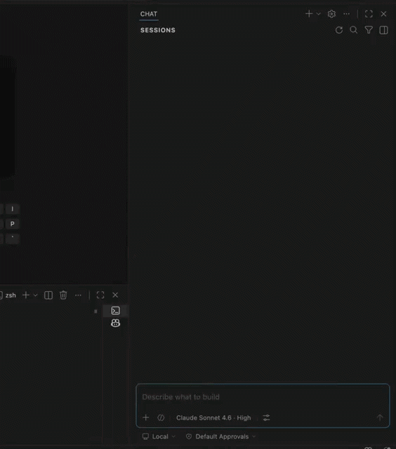

# AI Engineering Starter Kit

[](https://github.com/bransbury/ai-engineering-starter-kit/actions/workflows/ci.yml)
[](LICENSE.md)
[](https://github.com/bransbury/ai-engineering-starter-kit/releases)
[](https://skills.sh/bransbury/ai-engineering-starter-kit)

**Shape. Ship. Plan. Patch. Prove.**

Practical AI-assisted engineering workflows: shape rough work, choose a safe delivery path, and verify before PR.


```text
Inspect → Clarify → Plan → Prove → Patch → Review → PR
```

The starter kit includes:

- **Plan. Patch. Prove. (`/ppp`)** — an interactive workflow for engineers using an IDE agent
- **Plan. Patch. Prove. Cloud (`ppp-cloud`)** — a non-interactive workflow for autonomous cloud coding agents
- **Shape (`/shape`)** — a shaping workflow that turns rough work into clear, testable PR-sized tasks
- **Ship (`/ship`)** — a coordination workflow that chooses the safest execution path across PPP, PPP Cloud, or parallel delivery
- repo templates for agent guidance, Copilot instructions, PR templates, and Cursor rules
- practical docs and examples for adoption

## Quick start

```bash
npx ai-engineering-starter-kit install
```

Or via the [skills.sh](https://skills.sh) ecosystem:

```bash
npx skills add bransbury/ai-engineering-starter-kit
```

If slash commands are supported in your tool, run one of:

```text
/shape <prompt>
/ship <prompt>
/ppp <prompt>
```

## If a slash-command skill does not work

These skills work only where your agent tool loads skills as slash commands.

Fallback invocation:

```text
Use the Plan. Patch. Prove workflow on this prompt:
<paste prompt>
```

Not sure which setup to use? See [IDE setup](docs/ide-setup.md).

Prefer shell scripts instead of `npx`?

```bash
git clone https://github.com/bransbury/ai-engineering-starter-kit
cd ai-engineering-starter-kit
./install.sh
```



## Which setup should I use?

| I am... | Do this |
| --- | --- |
| Trying the workflows personally | Run `npx ai-engineering-starter-kit install` |
| Rolling out to a repo | Copy `templates/AGENTS.md` and `templates/copilot-instructions.md` |
| Using Cursor | Copy `templates/cursor-ppp-rule.mdc` |
| Shaping rough work first | Run `npx ai-engineering-starter-kit install` and use `/shape` |
| Coordinating multi-step delivery | Run `npx ai-engineering-starter-kit install` and use `/ship` |
| Assigning cloud-agent tasks | Run `npx ai-engineering-starter-kit install --repo-local`, add `AGENTS.md`, and use `ppp-cloud` |

## Which skill should I use?

| I want to... | Use |
| --- | --- |
| Clarify or split rough work before coding | `/shape` |
| Choose the safest delivery path for a task or feature slice | `/ship` |
| Complete one focused task interactively in an IDE | `/ppp` |
| Delegate one clear bounded task to an autonomous coding agent | `ppp-cloud` |

Examples:

```text
/shape Add role-based approvals to expense reports.
/ship Roll out the saved-reports feature safely across UI, validation, and docs.
/ppp Add an empty state to the experiment results table.
ppp-cloud Add regression tests for report-name validation.
```

## How PPP works

PPP stands for:

- **Plan** the smallest safe complete change.
- **Patch** the code in small, controlled steps.
- **Prove** it works before PR.

The actual workflow is deliberately proof-first:

```text
Inspect → Clarify → Plan → Prove → Patch → Review → PR
```

Prove starts before Patch: the agent defines the proof first, then patches in small loops and runs the proof as it goes.

### IDE flow

```text
Ticket
  ↓
/ppp
  ↓
Inspect → Clarify → Plan → Prove → Patch → Review → PR
  ↓
PR handoff
```

### Cloud flow

```text
Issue
  ↓
ppp-cloud
  ↓
Draft PR or blocker
```

## What gets installed?

The installers copy all four skills to common personal skill locations:

```text
~/.agents/skills/<skill-name>/SKILL.md
~/.claude/skills/<skill-name>/SKILL.md
~/.copilot/skills/<skill-name>/SKILL.md
```

Where `<skill-name>` is one of `ppp`, `ppp-cloud`, `shape`, or `ship`.

If a `.cursor/` directory is detected in the current directory, it also installs the Cursor rule:

```text
.cursor/rules/ppp.mdc
```

Run `npx ai-engineering-starter-kit install` or `./install.sh` from each project where you want the Cursor rule active.

## Repo-local install

GitHub supports project skills in `.github/skills`, `.claude/skills`, or `.agents/skills`. If you want the workflows to live with a specific repo instead of your personal environment, copy the skills into one of those project-local locations.

For GitHub project skills:

```bash
npx ai-engineering-starter-kit install --repo-local
```

For most teams, the most reliable repo rollout is:

- repo-local skills for `/shape`, `/ship`, `/ppp`, and `ppp-cloud`
- `AGENTS.md` at the repo root
- `.github/copilot-instructions.md` for VS Code + Copilot
- `.cursor/rules/ppp.mdc` for Cursor projects

## When to use `/ppp`

Use `/ppp` for normal engineering work that should fit in one focused PR:

- bug fixes
- small features
- tests
- UI tweaks
- small refactors

Good examples:

```text
/ppp Fix whitespace-only report names being accepted.
/ppp Add an empty state to the experiment results table when there are no rows.
```

## When not to use `/ppp`

Do not use `/ppp` to implement a whole large feature in one go.

Examples that are too large:

```text
/ppp Build a new analytics dashboard.
/ppp Implement the new permissions system.
```

For large work, ask `/ppp` to identify the smallest first task, or use a feature-slicing workflow.

For vague or multi-PR work, prefer `/shape` or `/ship` first.

## What good looks like

A good PPP run should:

- inspect relevant code before editing
- ask only important questions
- define how the change will be verified before editing
- add or update tests/checks where appropriate
- stop after two focused failed fix attempts
- review production readiness
- prepare a PR title/body using repo conventions

See a [full example run](examples/prompts/ppp-examples.md#what-good-output-looks-like).

## Cloud agent usage

| | `/ppp` | `ppp-cloud` |
| --- | --- | --- |
| **Who drives it** | Engineer in IDE | Autonomous cloud agent |
| **Interaction** | Interactive menus | Non-interactive, runs to completion |
| **Output** | Guided session → PR handoff | Draft PR or blocker report |
| **Best for** | Any normal ticket with a human in the loop | Clear, bounded tasks you can assign and review |

Use `ppp-cloud` for autonomous coding agents. It is designed for clear, bounded, verifiable tasks where the agent should either:

- create one focused draft PR; or
- stop with a clear blocker explaining why it could not proceed safely.

See [Cloud agent usage](docs/cloud-agent-usage.md).

## How is this different?

- Some skills are broad libraries of composable expert workflows.
- Some tools are opinionated operating systems for full-stack or product development.
- PPP is a narrow, practical workflow for everyday engineering tasks.
- It focuses on a simple loop: inspect first, plan the smallest safe change, prove it before patching broadly, and hand off a reviewable PR.

## Docs and templates

### Docs

- [How to use PPP](docs/how-to-use-ppp.md)
- [IDE setup](docs/ide-setup.md)
- [Cloud agent usage](docs/cloud-agent-usage.md)
- [Parallel agent coordination](docs/parallel-agent-coordination.md)
- [Adoption rollout](docs/adoption-rollout.md)
- [Release automation spec](docs/release-automation-spec.md)
- [Troubleshooting](docs/troubleshooting.md)

### Templates

If you don't already have them, copy these into your repos to give AI agents consistent guidance:

| Template | Copy to | Purpose |
| --- | --- | --- |
| `templates/AGENTS.md` | `AGENTS.md` (repo root) | Tells agents which workflow to use and what requires human approval |
| `templates/copilot-instructions.md` | `.github/copilot-instructions.md` | Repo-level Copilot instructions picked up automatically in VS Code |
| `templates/PULL_REQUEST_TEMPLATE.md` | `.github/PULL_REQUEST_TEMPLATE.md` | Consistent PR descriptions across human and AI-authored PRs |
| `templates/cursor-ppp-rule.mdc` | `.cursor/rules/ppp.mdc` | Cursor project rule — automatically installed by `npx ai-engineering-starter-kit install` or `./install.sh` if `.cursor/` exists |

Each template is intentionally minimal. Add repo-specific conventions (architecture rules, test commands, forbidden areas) directly in `AGENTS.md` and `copilot-instructions.md`.

## Security note

Skills are operational instructions that can influence AI agent behaviour. Review changes to `SKILL.md` files carefully.

Do not add secrets, credentials, internal-only URLs, or sensitive customer data to skills or examples.

## License

[MIT](LICENSE.md) © 2026 Marcus Bransbury
