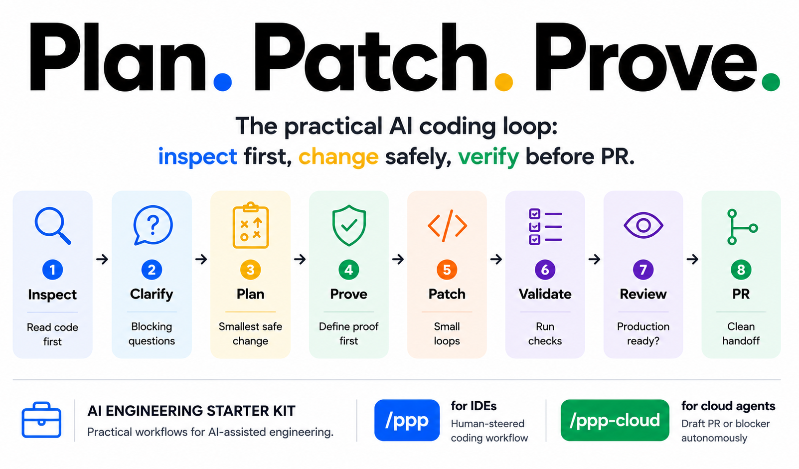

# AI Engineering Starter Kit

[](https://github.com/bransbury/ai-engineering-starter-kit/actions/workflows/ci.yml)
[](LICENSE.md)
[](https://github.com/bransbury/ai-engineering-starter-kit/releases)

Most engineers using AI assistants fall into the same pattern: ask a question in chat, paste the answer in, skip the tests, move on. It's fast until it isn't — reviews catch things nobody fully understands, tests get weakened to make CI pass, and the agent confidently makes decisions it shouldn't.

**Plan. Patch. Prove.**

The practical AI coding loop: inspect first, change safely, verify before PR.



```text
Inspect → Clarify → Plan → Prove → Patch → Review → PR
```

This kit gives engineers two structured workflows that keep AI coding both fast and safe.

The starter kit includes:

- **Plan. Patch. Prove. (`/ppp`)** — an interactive workflow for engineers using an IDE agent
- **Plan. Patch. Prove. Cloud (`ppp-cloud`)** — a non-interactive workflow for autonomous cloud coding agents
- repo templates for agent guidance, Copilot instructions, PR templates, and Cursor rules
- practical docs and examples for adoption

## How PPP works

PPP stands for:

- **Plan** the smallest safe complete change.
- **Patch** the code in small, controlled steps.
- **Prove** it works before PR.

The actual workflow is deliberately proof-first:

```text
Inspect → Clarify → Plan → Prove → Patch → Review → PR
```

Prove starts before Patch: the agent defines the proof first, then patches in small loops and runs the proof as it goes.

## How it works

### IDE flow

```text
Ticket
  ↓
/ppp
  ↓
Inspect → Clarify → Plan → Prove → Patch → Review → PR
  ↓
PR handoff
```

### Cloud flow

```text
Issue
  ↓
ppp-cloud
  ↓
Draft PR or blocker
```

## What you get

PPP helps AI coding agents:

- inspect the relevant code before editing;
- clarify only blocking questions;
- plan the smallest safe complete change;
- define proof before patching;
- patch in small validated loops;
- review production readiness;
- prepare a PR handoff.

> Plan the change. Patch safely. Prove it before PR.

## Which setup should I use?

| I am... | Do this |
| --- | --- |
| Trying PPP personally | Run `./install.sh` |
| Rolling out to a repo | Copy `templates/AGENTS.md` and `templates/copilot-instructions.md` |
| Using Cursor | Copy `templates/cursor-ppp-rule.mdc` |
| Assigning cloud-agent tasks | Use `ppp-cloud` and repo instructions |

## Quick start

```bash
git clone https://github.com/bransbury/ai-engineering-starter-kit
cd ai-engineering-starter-kit
./install.sh
```

Important: `/ppp` works only where your agent tool loads skills as slash commands. If it does not, use the fallback invocation below.

If slash commands are supported in your tool, run:

```text
/ppp <paste ticket or task>
```

Fallback invocation (always works):

```text
Use the Plan. Patch. Prove workflow on this ticket:
<paste ticket>
```

Not sure which to use? See [IDE setup](docs/ide-setup.md).

## How is this different?

- Matt Pocock's skills are a broad library of composable expert workflows.
- `gstack` is an opinionated full-stack and product operating system.
- PPP is a small starter kit for teams who need a safe everyday AI coding loop.
- PPP is deliberately narrow: inspect first, make the smallest safe change, prove it, then hand off a reviewable PR.

## What gets installed?

The install script copies the skills to both common personal skill locations:

```text
~/.agents/skills/ppp/SKILL.md
~/.agents/skills/ppp-cloud/SKILL.md
~/.copilot/skills/ppp/SKILL.md
~/.copilot/skills/ppp-cloud/SKILL.md
```

If a `.cursor/` directory is detected in the current directory, it also installs the Cursor rule:

```text
.cursor/rules/ppp.mdc
```

Run `./install.sh` from each project where you want the Cursor rule active.

## Repo-local install

GitHub supports project skills in `.github/skills`, `.claude/skills`, or `.agents/skills`. If you want PPP to live with a specific repo instead of your personal environment, copy the skills into one of those project-local locations.

For GitHub project skills:

```bash
mkdir -p .github/skills/ppp .github/skills/ppp-cloud
cp skills/ppp/SKILL.md .github/skills/ppp/SKILL.md
cp skills/ppp-cloud/SKILL.md .github/skills/ppp-cloud/SKILL.md
```

For most teams, the most reliable repo rollout is:

- repo-local skills for `/ppp` and `ppp-cloud`
- `AGENTS.md` at the repo root
- `.github/copilot-instructions.md` for VS Code + Copilot
- `.cursor/rules/ppp.mdc` for Cursor projects

## When to use `/ppp`

Use `/ppp` for normal engineering work that should fit in one focused PR:

- bug fixes
- small features
- tests
- UI tweaks
- small refactors

Good examples:

```text
/ppp Fix whitespace-only report names being accepted.
/ppp Add an empty state to the experiment results table when there are no rows.
/ppp Update the token parser to preserve {{firstName|}} as an explicit empty fallback.
```

## When not to use `/ppp`

Do not use `/ppp` to implement a whole large feature in one go.

Examples that are too large:

```text
/ppp Build a new analytics dashboard.
/ppp Implement the new permissions system.
```

For large work, ask `/ppp` to identify the smallest first task, or use a feature-slicing workflow.

## What good looks like

A good PPP run should:

- inspect relevant code before editing
- ask only important questions
- define how the change will be verified before editing
- add or update tests/checks where appropriate
- stop after two focused failed fix attempts
- review production readiness
- prepare a PR title/body using repo conventions

See a [full example run](examples/prompts/ppp-examples.md#what-good-output-looks-like).

## Example: bug fix

User:

```text
/ppp Fix whitespace-only report names being accepted.
```

PPP:

- inspects validation files before editing
- asks no unnecessary questions because the failure mode is clear
- plans proof first by identifying the missing whitespace-only test
- patches validation with the smallest safe change
- runs targeted tests
- reviews production readiness and prepares the PR handoff

See the expanded transcript in [PPP example prompts](examples/prompts/ppp-examples.md#what-good-output-looks-like).

## Cloud agent usage

| | `/ppp` | `ppp-cloud` |
| --- | --- | --- |
| **Who drives it** | Engineer in IDE | Autonomous cloud agent |
| **Interaction** | Interactive menus | Non-interactive, runs to completion |
| **Output** | Guided session → PR handoff | Draft PR or blocker report |
| **Best for** | Any normal ticket with a human in the loop | Clear, bounded tasks you can assign and review |

Use `ppp-cloud` for autonomous coding agents. It is designed for clear, bounded, verifiable tasks where the agent should either:

- create one focused draft PR; or
- stop with a clear blocker explaining why it could not proceed safely.

See [Cloud agent usage](docs/cloud-agent-usage.md).

## Docs

- [How to use PPP](docs/how-to-use-ppp.md)
- [IDE setup](docs/ide-setup.md)
- [Cloud agent usage](docs/cloud-agent-usage.md)
- [Adoption rollout](docs/adoption-rollout.md)
- [Release automation spec](docs/release-automation-spec.md)
- [Troubleshooting](docs/troubleshooting.md)

## Templates

Copy these into your repos to give AI agents consistent guidance:

| Template | Copy to | Purpose |
| --- | --- | --- |
| `templates/AGENTS.md` | `AGENTS.md` (repo root) | Tells agents which workflow to use and what requires human approval |
| `templates/copilot-instructions.md` | `.github/copilot-instructions.md` | Repo-level Copilot instructions picked up automatically in VS Code |
| `templates/PULL_REQUEST_TEMPLATE.md` | `.github/PULL_REQUEST_TEMPLATE.md` | Consistent PR descriptions across human and AI-authored PRs |
| `templates/cursor-ppp-rule.mdc` | `.cursor/rules/ppp.mdc` | Cursor project rule — automatically installed by `./install.sh` if `.cursor/` exists |

Each template is intentionally minimal. Add repo-specific conventions (architecture rules, test commands, forbidden areas) directly in `AGENTS.md` and `copilot-instructions.md`.

## Security note

Skills are operational instructions that can influence AI agent behaviour. Review changes to `SKILL.md` files carefully.

Do not add secrets, credentials, internal-only URLs, or sensitive customer data to skills or examples.

## License

[MIT](LICENSE.md) © 2026 Marcus Bransbury
